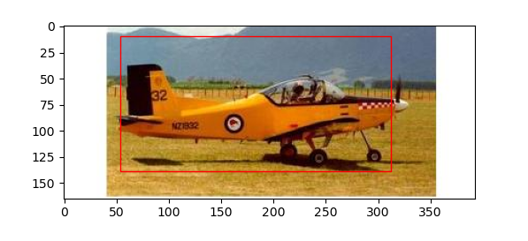

# RCNN-PYTORCH
  A minimal PyTorch implementation of RCNN, with support for training, inference and evaluation.
  
# Paper
  Rich feature hierarchies for accurate object detection and semantic segmentation
  
  https://arxiv.org/abs/1311.2524
  
# Desc
  The pytorch re-implement of rcnn. 
  
  Still Have many problem.
  
  Only train on small dataset.
  
  Can be used to better understand rcnn.
  
# Demo
    python detect.py
    
# Result

  

# train data
    data
      --Annotations
        --airplanes
          --annotation_0001.mat
          --annotation_0002.mat
        --ant
          --annotation_0001.mat
          --annotation_0002.mat
      --JPEGImages
        --airplanes
          --image_0001.jpg
          --image_0002.jpg
        --ant
          --image_0001.jpg
          --image_0002.jpg
# train
    python train.py

# weights file
    weights
  
      -- efficientnet_b0.pth

      -- ridge.pkl

      -- svm.pkl
